# Visualizações e Diagramas

Este documento apresenta a representação visual da arquitetura de dados Medallion do projeto e detalha as visualizações geradas para análise estatística.

---

## 🏗️ 1. Diagrama de Arquitetura de Dados (Pipeline ETL)

Abaixo está representado o fluxo sequencial dos dados desde a ingestão da API do Kaggle até a persistência das simulações estatísticas no diretório de saída:

```mermaid
graph LR
    subgraph Ingestao [Camada Bronze - Raw]
        API[Kaggle API] -->|download.py| RAW1[(results.csv)]
        API -->|download.py| RAW2[(fifa_ranking.csv)]
    end

    subgraph Transformacao [Camada Silver - Processed]
        RAW1 -->|etl.py| CLEAN[Limpeza e Filtragem]
        RAW2 -->|etl.py| NORMAL[Normalização de Nomes]
        CLEAN & NORMAL -->|etl.py| MERGE[Cruzamento Temporal]
    end

    subgraph Analitica [Camada Gold - Output]
        MERGE -->|modelo.py| POISSON[Regressão de Poisson]
        POISSON -->|monte_carlo.py| MONTE_CARLO[Simulador 100k]
        MONTE_CARLO -->|Salvar Resultados| OUT[(resultados_simulacao.csv)]
    end
    
    subgraph Visualizacao [Visualização de Dados]
        OUT -->|plot_dashboard.py| DASH[dashboard_monte_carlo_gols.png]
        OUT -->|plot_simulation.py| PLOT[simulacao_monte_carlo_gols_brasil.png]
    end

    style API fill:#1E73BE,stroke:#333,stroke-width:1px,color:#fff
    style OUT fill:#059669,stroke:#333,stroke-width:1px,color:#fff
    style DASH fill:#D97706,stroke:#333,stroke-width:1px,color:#fff
    style PLOT fill:#D97706,stroke:#333,stroke-width:1px,color:#fff
```

---

## 📊 2. Visualizações Geradas

Os scripts de plotagem exportam dois tipos de gráficos estatísticos estruturados para análise técnica e publicação:

### A. Dashboard Executivo de Monte Carlo
Painel executivo com cards KPI compactos para cenários estatísticos e eixos secundários mostrando frequência relativa combinada com probabilidade acumulada.
* **Caminho do arquivo:** `data/output/dashboard_monte_carlo_gols.png`
* **Especificações:** DPI 400 (Ultra alta definição)

### B. Histograma Clássico de Frequências
Visualização limpa focada em histograma de gols com linhas de referência indicando a Média, Mediana (P50), P10 e P90.
* **Caminho do arquivo:** `data/output/simulacao_monte_carlo_gols_brasil.png`
* **Especificações:** DPI 300 (Qualidade web)
