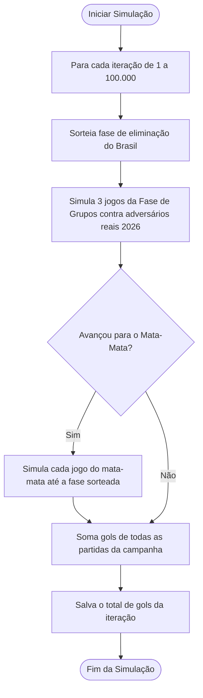

# Metodologia Estatística e Modelagem

Este documento detalha o embasamento estatístico e a modelagem matemática utilizada para prever a distribuição de gols da Seleção Brasileira na Copa do Mundo de 2026.

---

## 1. Classificação de Adversários (Categorias A a E)

A força competitiva de cada seleção adversária é modelada de forma discreta a partir de seu ranking histórico oficial da FIFA. As seleções são agrupadas em 5 categorias de força:

* **Categoria A (Elite):** Seleções posicionadas entre o **1º e o 10º lugar** no ranking (ex: Argentina, França, Inglaterra, Marrocos).
* **Categoria B (Forte):** Seleções posicionadas entre o **11º e o 25º lugar** (ex: EUA, Colômbia, Alemanha).
* **Categoria C (Médio-Forte):** Seleções posicionadas entre o **26º e o 40º lugar** (ex: Escócia, Chile, Turquia).
* **Categoria D (Médio):** Seleções posicionadas entre o **41º e o 60º lugar** (ex: Coreia do Sul, Romênia).
* **Categoria E (Fraco):** Seleções posicionadas no **61º lugar ou abaixo** (ex: Haiti, Bolívia).

---

## 2. O Modelo Estatístico: Regressão de Poisson

Os gols marcados em uma partida de futebol são eventos raros e independentes dentro de um intervalo de tempo contínuo (90 minutos), o que os torna ideais para serem modelados por uma **Distribuição de Poisson**.

A função de probabilidade de marcar $k$ gols em uma partida é expressa como:

$$P(Y = k) = \frac{e^{-\lambda} \lambda^k}{k!}$$

Onde $\lambda$ representa a taxa esperada (média) de gols.

### O Modelo Linear Generalizado (GLM)
Utilizamos um modelo de regressão de Poisson para expressar o $\lambda$ do Brasil a partir de duas variáveis explicativas categóricas:
1. **Categoria do Adversário** ($A, B, C, D, E$)
2. **Tipo de Jogo** (`Oficial` ou `Amistoso`)

A equação do modelo é:

$$\log(\lambda) = \beta_0 + \beta_1 \cdot \text{Categoria\_Adversario} + \beta_2 \cdot \text{Tipo\_Jogo}$$

O modelo é treinado utilizando o pacote `statsmodels` a partir de todo o histórico de partidas oficiais e amistosas da Seleção Brasileira no século XXI (desde 2001).

---

## 3. Estrutura da Competição (Copa de 48 Seleções)

A Copa do Mundo de 2026 introduz um novo regulamento com 48 seleções:
* O torneio passa a ter **3 jogos na Fase de Grupos** e um mata-mata que se inicia nos **16avos de final**.
* O número máximo de partidas para um finalista ou semifinalista passa de 7 para **8 jogos**.

A quantidade de partidas disputadas pelo Brasil ($N$) em cada campanha simulada é uma variável aleatória condicionada à sua fase de eliminação, assumindo os valores:
* $N = 3$ (eliminado na Fase de Grupos)
* $N = 4$ (eliminado nos 16-avos de final)
* $N = 5$ (eliminado nas Oitavas de final)
* $N = 6$ (eliminado nas Quartas de final)
* $N = 8$ (Semifinalista/Finalista - joga semifinal + final ou disputa de 3º lugar)

---

## 4. Probabilidade de Fase (Suavização de Jeffreys)

As probabilidades do Brasil terminar a copa em cada um dos cenários acima foram mapeadas usando o desempenho histórico da seleção nas edições de 2002 a 2022. 

Para transpor o histórico (onde o torneio tinha 32 times) para o novo formato de 48 seleções, usamos o conceito de **profundidade competitiva (Best-N)**:
* Quedas nas Quartas de final no formato antigo (5º jogo, Best-8) equivalem à eliminação nas Quartas de final do novo formato (6º jogo).
* Quedas nas Oitavas de final no formato antigo (4º jogo, Best-16) equivalem à eliminação nas Oitavas do novo formato (5º jogo).

### Suavização de Jeffreys
Como o Brasil nunca foi eliminado na fase de grupos ou na primeira fase de mata-mata no século XXI, o cálculo de probabilidade pura resultaria em $0\%$ de chance de queda precoce. Para evitar o viés da probabilidade zero, aplicamos a **Suavização de Jeffreys** ($\alpha = 0.5$):

$$P(\text{Eliminação na Fase } f) = \frac{N_{\text{eliminações na fase } f} + 0.5}{N_{\text{copas}} + 0.5 \times N_{\text{fases}}}$$

Isso adiciona uma pequena probabilidade reguladora para todos os cenários possíveis de eliminação.

---

## 5. Simulação de Monte Carlo

A simulação computacional executa **100.000 iterações** seguindo o algoritmo:

Os gols de cada partida são sorteados aleatoriamente a partir de uma distribuição de Poisson com o parâmetro $\lambda$ calculado pelo modelo para aquela categoria de adversário em jogo oficial.
